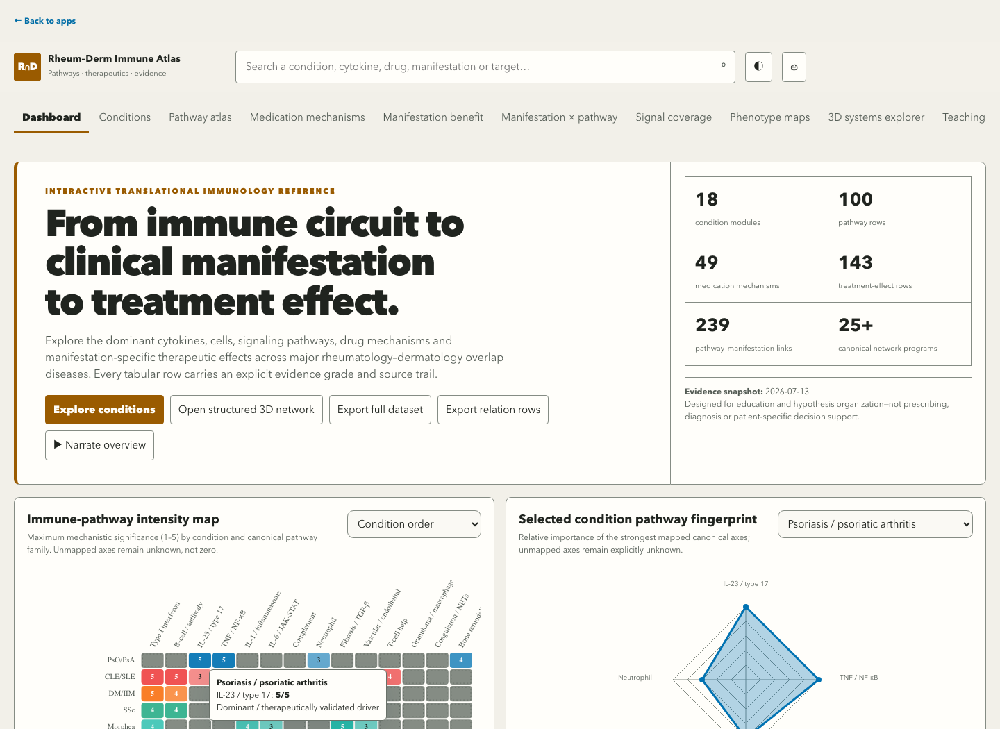
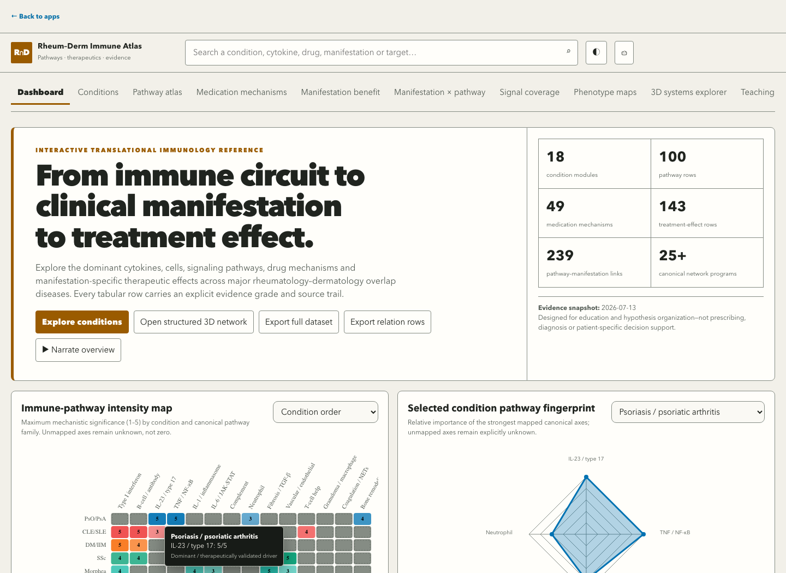
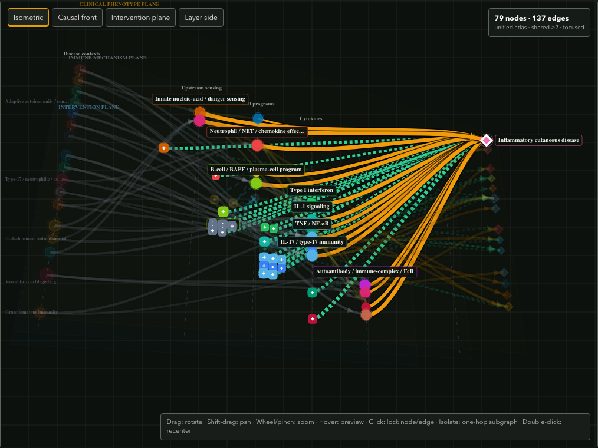
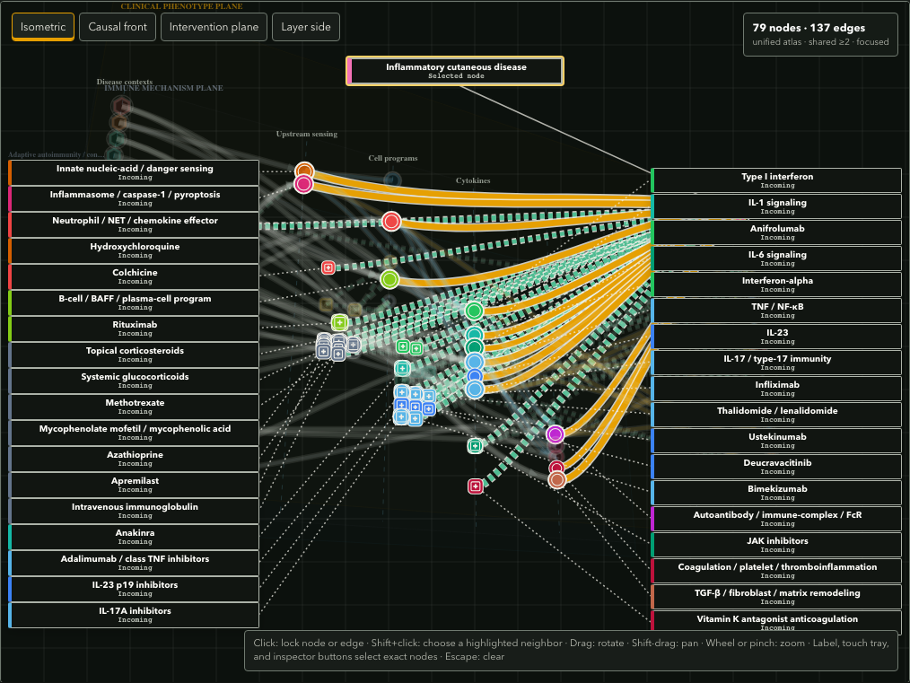

# Rheum–Derm Atlas contrast and graph-interaction release evidence

Date: 2026-07-14

Base commit: `3584cf56cab9fa0310a4d3d79b02c569e0bb0a24`

Runtime: Node `22.12.0`; npm `10.9.0`

Asset identifier: `atlas-contrast-graph-20260714`

## Disposition

The bounded contrast and 3D graph-interaction tranche is **release-candidate complete pending merge and production hash verification**. All local release gates are closed.

The implementation changes presentation and interaction only. It does not add or delete biological entities or relationships; change coordinates, evidence grades, provenance, direction, magnitude, denominators, or graph filters; or reinterpret unknown, explicit-zero, threshold-filtered, derived, direct, or structurally-unavailable states.

## Implemented result

- The intensity-map tooltip uses one typed mapped/unknown formatter and an opaque mineral-charcoal surface in both themes. Title, body, muted copy, border, links, emphasis, focus, clamping, and zoom behavior have explicit tokens.
- Heatmap cells are composited against the rendered theme surface and receive measured black or bone numeral ink. All `18 conditions × 5 values × 2 themes = 180` palette pairs meet 4.5:1.
- Evidence grades, graph relation families, neutral node/edge keylines, graph labels, focus rings, legends, badges, and the coverage slice use theme-specific, independently measured colors.
- A locked graph selection exposes one HTML label for every unique endpoint of a currently rendered highlighted edge. Filtered, hidden, unknown, or structurally unavailable relationships cannot create active labels.
- Desktop/tablet endpoint labels use deterministic two-sided packing, complete untruncated node names, and leader lines. The selected node occupies a reserved, non-overlapping top band with its own leader line.
- Narrow/coarse layouts retain compact projected orientation labels and add a locally scrolling 44 px connected-node tray. The full inspector remains available below the graph.
- Pointer activation and manipulation share one five-CSS-pixel gesture state. Click selects, drag rotates, Shift-drag pans, wheel/pinch zooms, completed drags do not activate, and Shift+click considers only currently highlighted connected endpoints.
- Label, touch-tray, inspector, precision-navigator, keyboard Escape, and live-status paths expose equivalent exact selection without clearing filters or isolation.
- The inspector groups complete incoming-visible, outgoing-visible, and hidden-by-current-filter relationships without the previous 24-row truncation.
- Playwright preview ports are configurable through `PLAYWRIGHT_PORT`, preventing concurrent worktrees from silently testing the wrong build.

## Measured contrast evidence

| Stratum | Light | Dark | Required floor |
| --- | ---: | ---: | ---: |
| Tooltip title | 17.26:1 | 17.26:1 | 7:1 |
| Tooltip body | 15.68:1 | 15.68:1 | 7:1 |
| Tooltip muted text | 10.23:1 | 10.23:1 | 4.5:1 |
| Tooltip border against surface | 8.22:1 | 8.22:1 | 3:1 |
| Lowest heatmap cell/numeral pair | 4.64:1 | 4.62:1 | 4.5:1 |
| Lowest evidence-opacity graph edge/background pair | 3.25:1 | 4.00:1 | 3:1 |
| Graph label/keyline token minimum | 4.99:1 | 8.70:1 | 3:1 boundary; 4.5:1 text |
| Atlas normal-text token minimum observed in rendered context | 4.99:1 | 5.84:1 | 4.5:1 |
| Atlas neutral boundary token against panel | 3.42:1 | 3.83:1 | 3:1 |

The deterministic visible-element sweep covers all 11 Atlas destinations and all seven Explorer representations at 390 and 1440 CSS px in both themes. Transparent ancestor backgrounds are composited before comparison. Canvas encodings are tested separately through explicit heatmap and graph palette contracts; they are not falsely treated as DOM pixels.

## Interaction and accessibility evidence

- The condition case exposes 14 labels for 14 unique drawable highlighted neighbors.
- Unified node `um:cutaneous` exposes all 36 labels for 36 visible highlighted relationships, with stable membership and ordering across redraw, view preset, rotation, pan, wheel zoom, resize, evidence threshold, and relationship-family changes.
- At desktop width, neither the selected label nor any of the 36 endpoint labels is truncated or mutually obscured; all label and projected-node coordinates stay inside the graph viewport.
- Shift+click uses expanded neighbor-only hit testing with distance, projected depth, and stable ID tie-breaking. Normal click behavior remains available when no node is locked.
- Rotation and Shift-pan beyond five CSS pixels preserve the locked selection and never activate or clear a node.
- Projected labels, 44 px touch-tray buttons, and relationship-inspector rows select the same exact node. Escape clears the graph and updates the polite live status.
- The graph canvas has a visible theme-specific focus ring. Reduced-motion and 320/390 px page-overflow contracts pass.
- Every relationship remains available in the structured inspector mirror, including rows hidden by the current filters; visually active labels remain restricted to rendered highlighted edges.

## Visual review

The final build was reviewed interactively at 390 and 1440 CSS px in light and dark themes. Review included mapped and unknown tooltips, the 14-neighbor condition selection, the 36-neighbor unified selection, rotation, Shift-pan, wheel zoom, Shift+click, projected-label selection, touch-emulated tray selection, inspector navigation, grayscale, deuteranopia, protanopia, tritanopia, focus, and overflow.

The first visual pass found that count-complete endpoint labels were still ellipsized and that the selected-node badge could be covered by an endpoint column. Both defects received failing contracts and were refined before this evidence was recorded.

### Before and after

| Before | After |
| --- | --- |
|  |  |
|  |  |

Additional reviewed simulations:

- [Grayscale high-degree graph](rheum-derm-atlas-contrast-graph-release-evidence/after-graph-achromatopsia.png)
- [Deuteranopia high-degree graph](rheum-derm-atlas-contrast-graph-release-evidence/after-graph-deuteranopia.png)
- [390 px unified graph, connected-node tray, inspector, and legend](rheum-derm-atlas-contrast-graph-release-evidence/after-graph-mobile.png)

## Automated gates

| Gate | Result |
| --- | --- |
| Dedicated contrast/graph-interaction suite | 22/22 passed |
| Combined dedicated and existing focused Atlas suites | 34/34 passed |
| Unit/policy suite | 33 files; 212/212 tests passed |
| Full Playwright suite | 195 passed; 21 opt-in visual tests skipped |
| Production build | Passed; existing >600 kB chunk advisory remains |
| Local production-server smoke | Passed; source and built Atlas assets are byte-identical |
| `git diff --check` | Passed during implementation review |

The first nine-worker full-browser run had one unrelated Egypt portfolio hydration timeout after 194 passes; the exact failure passed in isolation, and the complete suite then passed with four workers. This is recorded as a concurrency flake, not silently pooled into the clean run.

Local reviewed-build SHA-256 manifest:

| Asset | SHA-256 |
| --- | --- |
| `index.html` | `7d9da1cccd62237b8fa44c70a238652cc12d2b87d09f699f33e07e5067a7bce8` |
| `systems-explorer.css` | `37de86817ed41c4f6e62eeb918d73bc5b6ecdf751af7b8158d04fdc4d393c5bf` |
| `alternative-views.css` | `4fd7d9b2f765859aac1364de63ba99bc7ac5636f03a74f4302b933eaa8c3b4a7` |
| `systems-explorer-shell.js` | `d655e6d8a8526d805b4dd52afe5669ed98661c0079fa10220042258cb25c383e` |
| `systems-explorer.js` | `3774575538670f52ce42e9fcbfadcd0944accc3de81cf69dda74a1a7ba739d96` |
| `alternative-views.js` | `b84ee92b4d2c5f57cce04f5e1b261655977a92b73de5a8a1d403e0b6d4b7c3af` |

## Residual risk

- Automated browser and visual-simulation evidence does not replace a formal human task-performance study or physical-device assistive-technology study. No comparative task-superiority claim is made.
- A 36-neighbor selection is inherently dense. The endpoint columns deliberately privilege completeness; the inspector and mobile tray remain the precision paths.
- Mobile projected labels are intentionally compact and may abbreviate visually. The adjacent connected-node tray and inspector preserve every full name and exact selection target.
- Canvas visual review covers the declared palettes and high-degree golden cases, not every possible camera pose. Deterministic containment, membership, and contrast contracts continue to run across redraw and filter changes.
- The current embedded contract still does not justify variable edge-width magnitude or temporal-response trajectories. No new magnitude or timing claim is introduced.
- The pre-existing large-bundle advisory, `xlsx` security debt, and dependency audit findings remain outside this bounded tranche unless a touched dependency changes their disposition.
